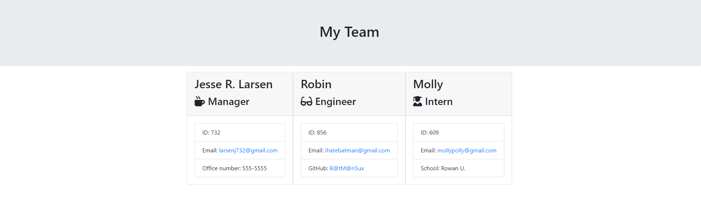

Template Engine

## Table of Contents
- [Description](#description)
- [Installation](#installation)
- [Usage](#usage)
- [License](#license)
- [Contributing](#contributing)
- [Tests](#tests)
- [Questions](#questions)
## Description
Command line application which generates an HTML page with standard team profiles. Positions include: Manager, Engineer and Intern. Uses fontawesome and bootstrap for easy output tweaking and adding additional html elements.
## Installation
To get dependencies, run:
npm install
## Usage
must reach out to me if you would like to contribute to directory.
## License
MIT
This application is covered by the MIT license. 
## How to contribute
see me for additional details.
## Tests
npm run test
GitHub: J35RL4R
Email: larsenj732@gmail.com
Copyright 2020